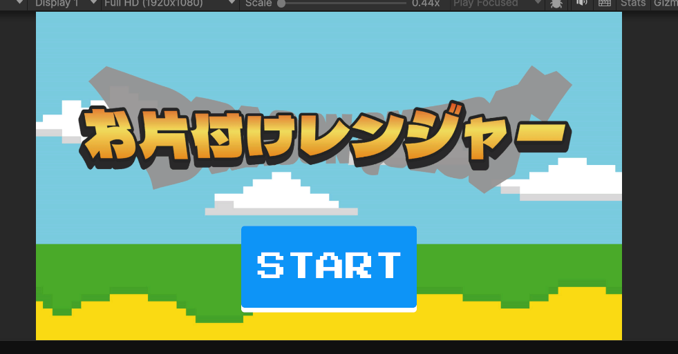
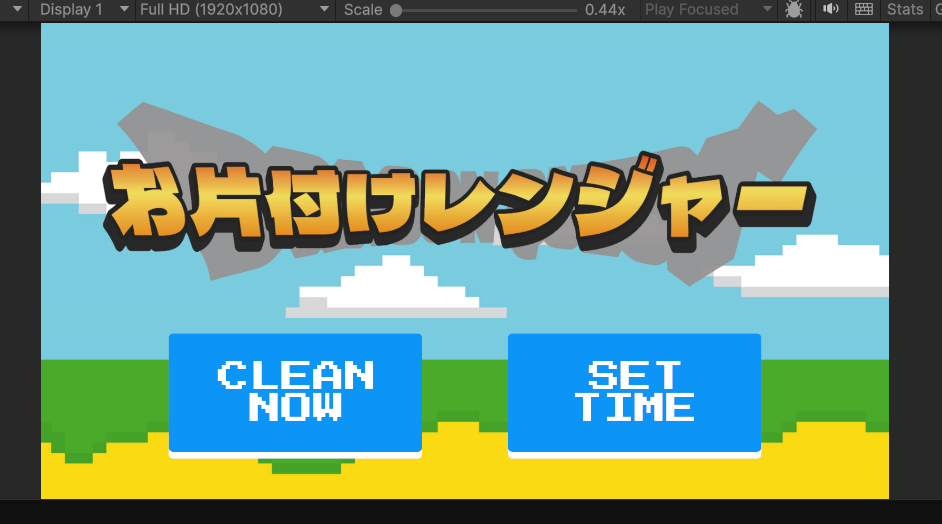
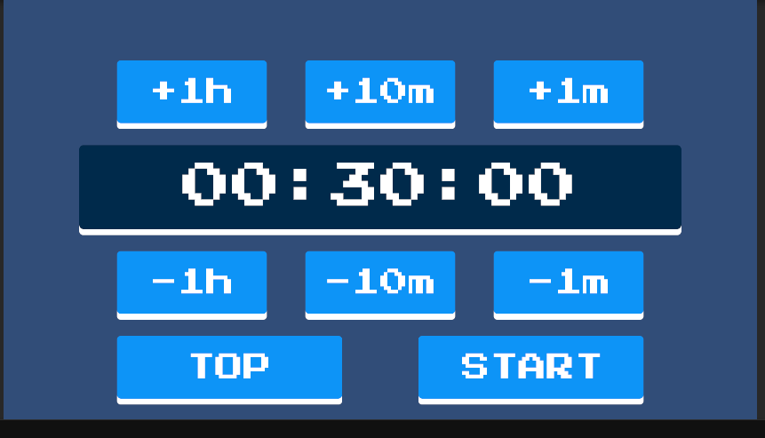
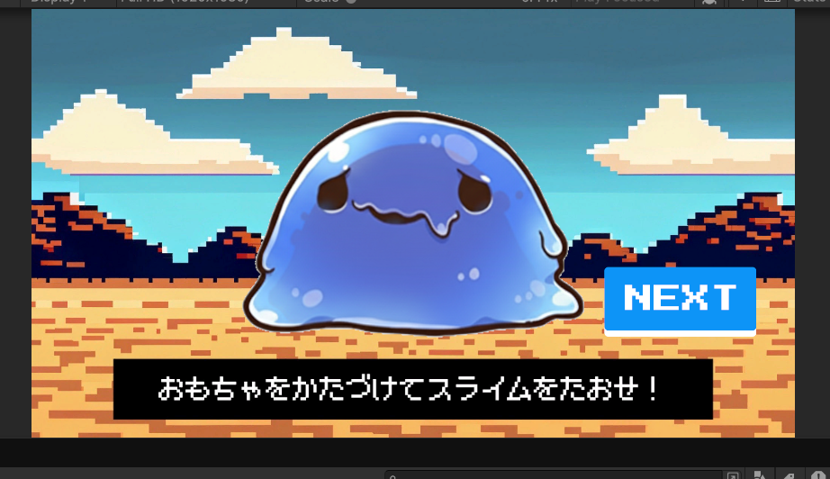
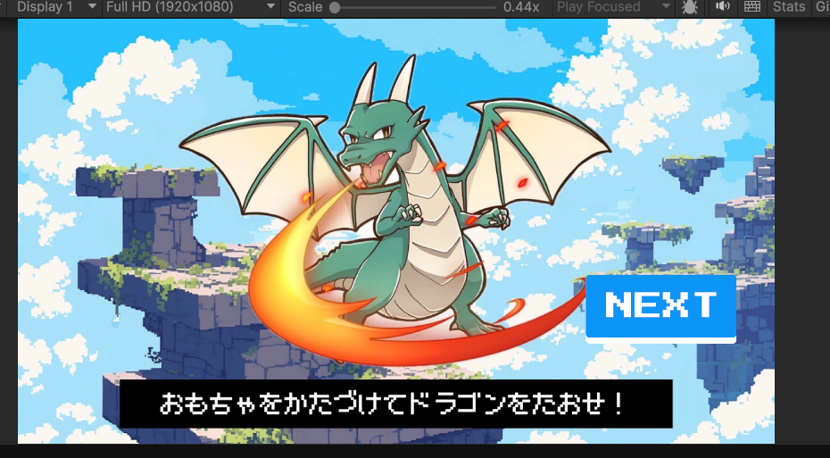
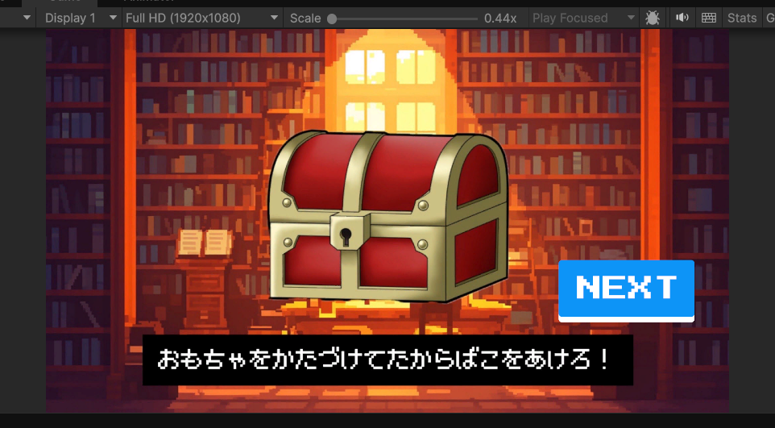

# お片付けチャレンジャー - Okatazuke Challenger

おもちゃ箱 × ゲーム × IoT。
Raspberry Pi と RFID リーダーを使って、片付けをゲーム化するプロジェクトです。

## 📖 プロジェクト概要

「お片付けチャレンジャー」は、片付けをゲーム感覚で楽しく取り組めるようにするWebアプリケーションです。RPGゲーム風のレトロなピクセルアートデザインと、タイマー機能、ステージクリア演出を組み合わせることで、特に子供や片付けが苦手な人のモチベーションを高めます。

### コンセプト

- 🎮 **ゲーミフィケーション**: RPG風の演出で片付けを冒険に変える
- ⏱️ **タイマー機能**: 準備時間を設定してチャレンジ開始までのカウントダウン
- 🏆 **ステージ制**: スライム、ドラゴン、宝箱などのステージクリア演出
- 🤖 **IoT連携**: Raspberry Pi と RFID リーダーで実際の片付けを検知

## 🖼️ スクリーンショット

### タイトル画面


### モード選択


### タイマー設定


### ステージ画面
<div>
  
  
</div>

### ボーナスステージ


## ✨ 主な機能

### 1. タイマーモード
- **CLEAN NOW**: すぐに片付けを開始
- **SET TIME**: 片付け開始までの準備時間を設定
  - 時間・分・秒を個別に調整可能
  - カウントダウンで準備時間を計測
  - タイマー終了後、片付けチャレンジがスタート

### 2. ステージ演出
片付けの進捗に応じて、RPG風のステージクリア演出が表示されます：
- **Stage 1**: スライムを倒せ！
- **Stage 2**: ドラゴンを倒せ！
- **Bonus Stage**: 宝箱を見つけろ！

### 3. RFID連携（予定）
- Raspberry Pi と RFID リーダーを使用
- おもちゃにRFIDタグを取り付け
- 片付けを物理的に検知してゲームと連動

### 4. レトロデザイン
- ピクセルアート/ドット絵風のUI
- RPGゲームのような世界観
- 青を基調としたカラースキーム

## 🛠️ 技術構成 / Tech Stack

### Frontend
- **Framework**: [Next.js 16](https://nextjs.org/) (TypeScript)
- **Styling**: [Tailwind CSS 4](https://tailwindcss.com/)
- **UI Components**: [shadcn/ui](https://ui.shadcn.com/)
- **Package Manager**: [pnpm](https://pnpm.io/)

### Backend
- **Framework**: [FastAPI](https://fastapi.tiangolo.com/) (Python)
- **Container**: Docker / Docker Compose

### IoT（予定）
- **Hardware**: Raspberry Pi
- **Sensor**: RFID リーダー

## 📁 プロジェクト構造

```
challenge-project-j/
├── frontend/          # Next.js フロントエンドアプリケーション
│   ├── src/
│   │   ├── app/       # Next.js App Router
│   │   ├── components/# UIコンポーネント
│   │   └── ...
│   └── README.md      # フロントエンド開発ガイドライン
├── backend/           # FastAPI バックエンドAPI
│   ├── app/
│   └── docker-compose.yml
├── design-mockups/    # デザインモックアップ
└── README.md          # このファイル
```

## 🚀 起動方法 / How to Run

### 前提条件
- Node.js 18以上
- pnpm
- Docker Desktop（バックエンドを起動する場合）

### 1. リポジトリのクローン

```bash
git clone https://github.com/masaya0322/challenge-project-j.git
cd challenge-project-j
```

### 2. フロントエンドの起動

```bash
cd frontend
pnpm install
pnpm dev
```

ブラウザで http://localhost:3000 を開く

### 3. バックエンドの起動（オプション）

詳細は下記の「backendの起動方法」を参照してください。

## 📝 Git操作

### リモートリポジトリに変更を反映

```bash
git add .
git commit -m "コミットメッセージ"
git push
```

### リモートリポジトリの変更をローカルに反映

```bash
# mainブランチの場合
git pull

# 他ブランチの場合は相談すること
```

## 🐳 Backendの起動方法

### 前提
- カレントディレクトリが `challenge-project-j` であること
- Docker Desktopが起動していること

### 1. dockerとdocker-composeがインストールされているかを確認

``` bash
docker --version
docker-compose --version
```

### 2. カレントディレクトリを移動

``` bash
cd backend
```
### 3. コンテナを作成
初めてコンテナを作成する場合は、docker-composeを用いてbuildをする必要がある。3.1.に進む

すでにコンテナを作成済みの場合は、docker-composeを用いて、コンテナを起動するだけで良い。3.2.に進む

3.2.の方法だと、ターミナルが1つ占有される。バックグラウンドで起動したい場合は3.3.に進む

### 3.1. 初めてコンテナを作成、起動する場合

``` bash
docker-compose up --build
```

### 3.2. コンテナを作成済みで起動する場合
既存のコンテナを起動するだけなので、buildは不要。
``` bash
docker-compose up
```

### 3.3. バックエンドで起動する場合
`docker-compose up`に`-d`オプションを追加する。
コンテナ作成済みの場合
``` bash
docker-compose up -d
```

### 4. 動作確認
別のターミナルを開き、

``` bash
curl http://localhost:8000/api/hello
```
を実行して、`Hello World`が帰ってくれば成功。

### コピー用
初めてコンテナを作成、起動する場合
``` bash
docker --version
docker-compose --version
cd backend
docker-compose up --build
```

コンテナを作成済みで起動する場合
``` bash
cd backend
docker-compose up
```

### コンテナを停止する
フォアグラウンドで起動している場合は、`CTRL + C`で停止。
バックグラウンドで起動している場合は、`docker-compose down`で停止。

### 備考
- コード変更時に再ビルドする必要はない。（`docker-compose.yml`上で、`--reload`オプションを有効にしているため）
- requirements.txtを変更した場合は、`docker-compose up --build`を再び行う必要がある
- コンテナを削除して、もう一度ビルドし直したい場合は、`docker-compose down --rmi all`を実行して、`docker-composte up --build`を実行する
## 📚 開発ガイドライン

### フロントエンド開発
フロントエンド開発の詳細なガイドライン、コーディング規約、ベストプラクティスについては、以下を参照してください：

👉 [Frontend開発ガイドライン](./frontend/README.md)

主な規約：
- ファイル名: ケバブケース（kebab-case）
- Export: default exportはページコンポーネントのみ
- コンポーネント: 最上位にマージンをつけない
- Claude Codeによるレビューを推奨

### コードレビュー
- プルリクエスト作成前に Claude Code でレビューを実施
- コーディング規約への準拠を確認
- 型安全性、パフォーマンス、アクセシビリティを考慮

## 🎯 画面遷移

```
タイトル画面
    ↓
モード選択画面
    ↓
┌───────────────┬──────────────────┐
│ CLEAN NOW     │  SET TIME        │
└───────────────┴──────────────────┘
        ↓               ↓
  すぐに開始      準備時間設定画面
        ↓               ↓
        │         準備時間カウントダウン
        │               ↓
        └───────┬───────┘
                ↓
      片付けチャレンジ開始
                ↓
          ステージ演出
     (Stage 1 → Stage 2 → Bonus)
                ↓
           結果画面
```

## 🤝 コントリビューション

1. このリポジトリをフォーク
2. 新しいブランチを作成 (`git checkout -b feature/amazing-feature`)
3. 変更をコミット (`git commit -m 'feat: Add amazing feature'`)
4. ブランチにプッシュ (`git push origin feature/amazing-feature`)
5. プルリクエストを作成

## 📄 ライセンス

このプロジェクトはチームプロジェクトです。

## 👥 開発チーム

- [@masaya0322](https://github.com/masaya0322)
- その他の貢献者

---

🎮 **お片付けを冒険に変えよう！**
